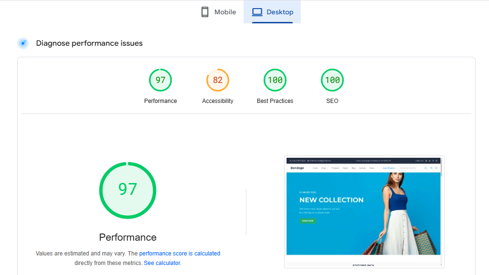
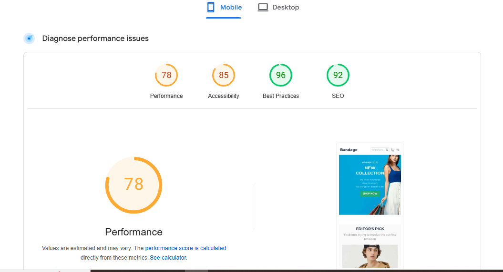

# Performance Testing Report

## Desktop View Performance Testing

**Performance Metrics:**
- **Performance Score:** 97
- **Accessibility:** 82
- **Best Practices:** 100
- **SEO:** 100

**Performance Summary:**
- Desktop performance is excellent with a score of 97.
- Best Practices and SEO are perfect at 100.
- Accessibility score is slightly lower at 82 and can be improved.

**Areas of Improvement:**
- Enhance accessibility features to meet compliance standards.

**Desktop View Screenshot:**

## Mobile View Performance Testing

**Performance Metrics:**
- **Performance Score:** 78
- **Accessibility:** 85
- **Best Practices:** 96
- **SEO:** 92

**Performance Summary:**
- Overall mobile performance score is 78, which indicates there is room for improvement.
- Accessibility is rated at 85, suggesting some minor enhancements are needed.
- Best Practices and SEO are in excellent condition.

**Areas of Improvement:**
- Optimize images and scripts to improve performance.
- Improve accessibility compliance.

**Mobile View Screenshot:**

---
These tests were conducted using **PageSpeed Insights**.

## Testing Tool
- **Tool Used:** PageSpeed Insights
- **Tested Views:** Mobile & Desktop
- **Tested Parameters:** Performance, Accessibility, Best Practices, and SEO

Further optimizations should focus on accessibility and performance improvements for mobile.

